# MCU Comparative Benchmark Suite

Comprehensive benchmarks comparing GradientBoosting (GBT) vs RandomForest (RF) inference performance across Host, Renode, and Hardware platforms.


## Overview

This benchmark suite provides multi-dimensional comparison of tree ensemble models for embedded ML:

**Platforms:**
- **Host**: Native CFFI execution (fast validation baseline)
- **Native Sim**: Zephyr native_sim (host-native integration testing)
- **Renode**: nRF52840 emulator with DWT cycle counter (instruction-level timing)
- **Hardware**: Nordic nRF52 DK (ground truth measurements)

**Benchmarks:**
- **latency**: Inference timing across platforms
- **sample_efficiency**: Trees needed to reach accuracy thresholds
- **pareto_efficiency**: Accuracy vs flash size Pareto frontiers
- **regression_accuracy**: MSE/R² on regression tasks
- **probability_calibration**: Brier score and ECE
- **size_constrained**: Best accuracy at fixed flash budgets
- **multiclass_latency**: GBT softmax latency and flash scaling with n_classes


## Testing

### Numerical Accuracy

The `regression_accuracy` benchmark compares emlearn C output against sklearn Python predictions. On tested datasets, MSE differences were within float32 tolerance (<0.1%).

```bash
# Run validation tests (from repo root)
.venv/bin/python -m pytest -v test/test_mcu_benchmark.py

# Renode parallel benchmarks (pytest-xdist)
source .env.local
.venv/bin/python -m pytest test/test_renode_benchmark.py -v           # Sequential
.venv/bin/python -m pytest -n 4 test/test_renode_benchmark.py -v      # Parallel

# Timing validation tests (CPI, DWT accuracy)
.venv/bin/python -m pytest test/test_renode_benchmark.py::test_dwt_vs_instruction_count_validation -v
```

### Renode Parallel Benchmarks

The `test/test_renode_benchmark.py` module provides parallel benchmarking:

**Architecture:**
1. **Build Phase** (session start): All model variants built sequentially to cache
2. **Run Phase** (parallel): Tests load pre-built ELFs and run Renode in parallel

**Features:**
- Cache versioned by source file hashes (auto-invalidates on changes)
- Each model gets isolated app directory (no CMake conflicts)
- pytest-xdist compatible: 4 workers reduce runtime significantly

**Cache Location:** `/tmp/emlearn_renode_benchmark_cache/`


## Benchmark Results

Results from testing on Renode nRF52840 (64 MHz, Cortex-M4F with hardware FPU enabled). Renode uses instruction-level simulation, so cycle counts are approximate and may differ from physical hardware. These are preliminary observations that may vary with different configurations, datasets, or hardware.

Raw data for the results below is available in [`data/`](data/):
- [`latency_standard.csv`](data/latency_standard.csv) — latency sweep (standard sigmoid/softmax)
- [`probability_calibration.csv`](data/probability_calibration.csv) — calibration sweep

### Probability Calibration

Best Brier scores (lower is better) from probability_calibration benchmark, minimized over n={3,10,20,40}, d={3,5}, lr={0.1,0.2,0.5}:

| Dataset | GBT Brier | RF Brier |
|---------|-----------|----------|
| digits (10-class) | 0.005 | 0.028 |
| embedded_synth (3-class) | 0.055 | 0.090 |
| sonar (binary) | 0.127 | 0.139 |
| wine (3-class) | 0.025 | 0.015 |
| iris (3-class) | 0.005 | 0.006 |
| breast_cancer (binary) | 0.031 | 0.031 |

GBT shows better calibration on larger/harder datasets (digits, embedded_synth, sonar). RF matches or beats GBT on smaller datasets (iris, wine, breast_cancer).

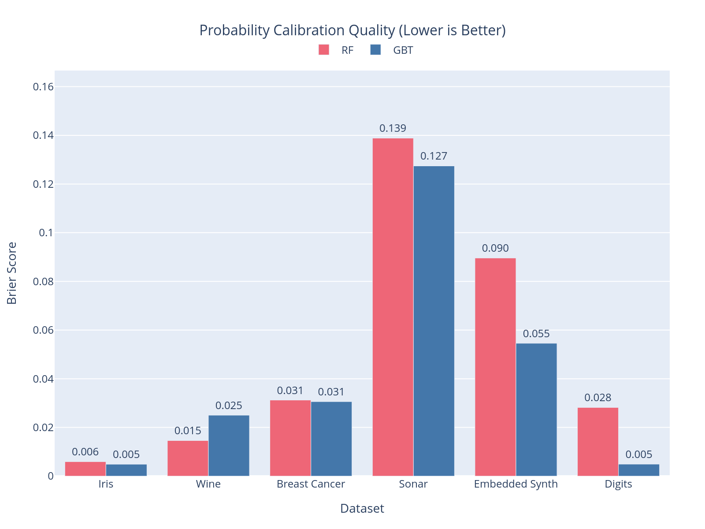

*Figure: Probability calibration quality (Brier score, lower is better). GBT demonstrates superior calibration on complex multi-class datasets (digits, embedded_synth) and challenging binary problems (sonar), while both models achieve similar calibration on simpler datasets (iris, breast_cancer). RF wins on wine.*

### Performance Comparison

Full per-configuration results (cycles, flash, accuracy for all n/d combinations) are in [`data/latency_standard.csv`](data/latency_standard.csv). The figures below summarize key patterns.

#### Binary Classification

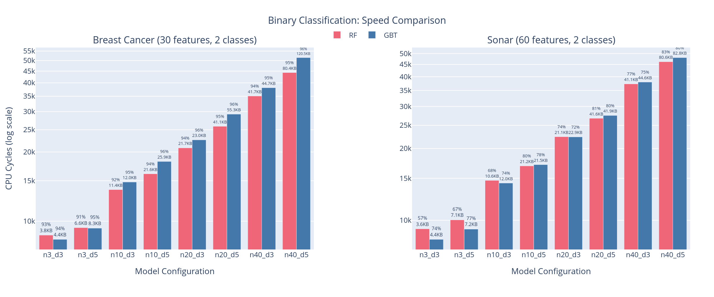

*Figure: Binary classification speed comparison in `predict_proba` mode showing RF and GBT. Bar height shows CPU cycles (log scale for visibility across wide range), labels show accuracy and flash size.*

##### Accuracy Score Comparison

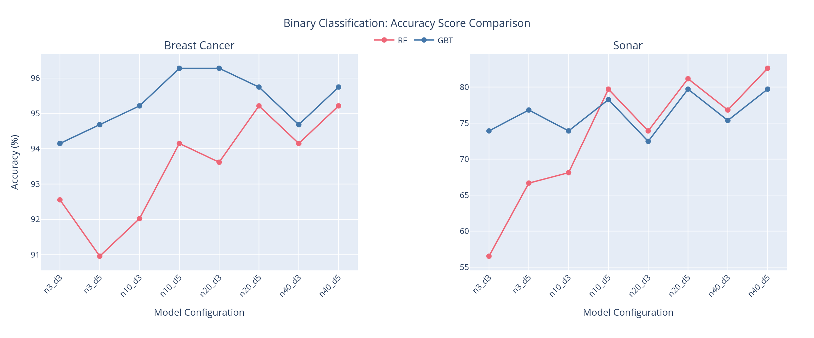

*Figure: Binary classification accuracy trends across model complexity. Shows how RF and GBT accuracy scores change with increasing n_estimators (n={3,10,20,40}) and max_depth (d={3,5}). Breast Cancer shows GBT maintaining consistently higher accuracy (~94-96%), while Sonar shows more variable performance with RF d=5 achieving best accuracy at n=40.*

##### Flash vs Accuracy Trade-off

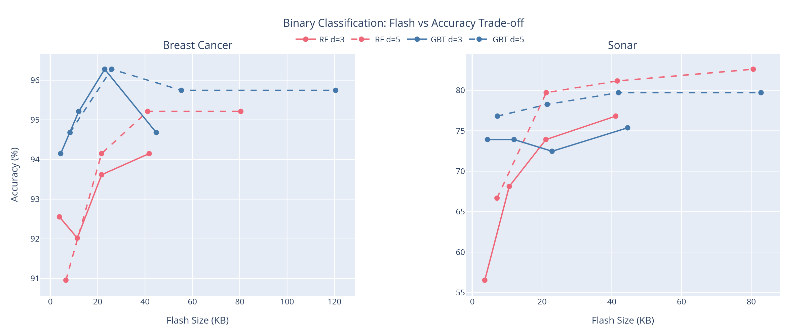

*Figure: Binary classification flash vs accuracy trade-off curves grouped by depth. Each line shows progression from n=3 to n=40 trees. Solid lines represent d=3, dashed lines d=5. Breast Cancer shows GBT achieving peak accuracy (~96%) at higher flash cost, while RF offers competitive accuracy with lower flash. Sonar shows RF d=5 achieving best accuracy (82%) with modest flash usage.*

##### Calibration Quality

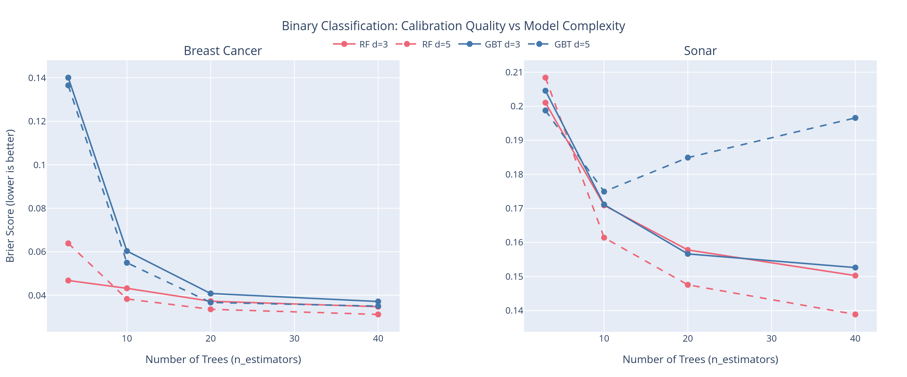

*Figure: Binary classification calibration quality (Brier score) vs model complexity. Lower scores indicate better-calibrated probabilities. Curves show n={3,10,20,40} trees (solid=d3, dashed=d5). Breast Cancer shows both models achieving similar calibration at larger n (Brier ~0.03), with GBT improving more steeply. Sonar shows GBT converging slightly better than RF at larger model sizes.*

#### Multi-class Classification

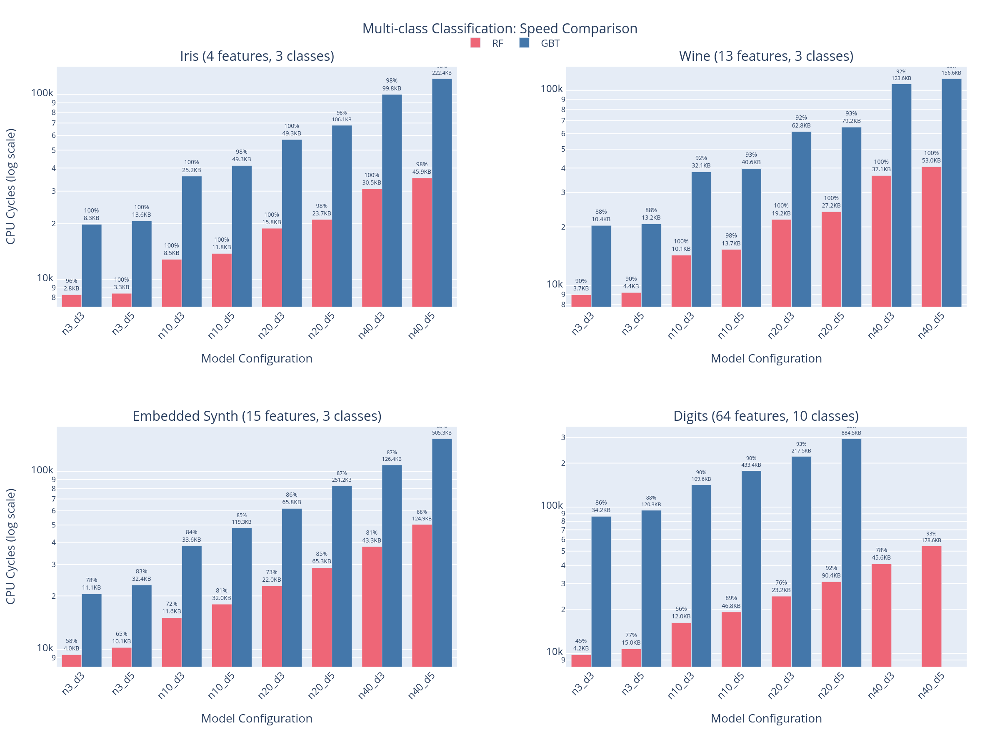

*Figure: Multi-class classification speed comparison in `predict_proba` mode showing RF and GBT. Bar height shows CPU cycles (log scale), labels show accuracy and flash size.*

##### Flash vs Accuracy Trade-off

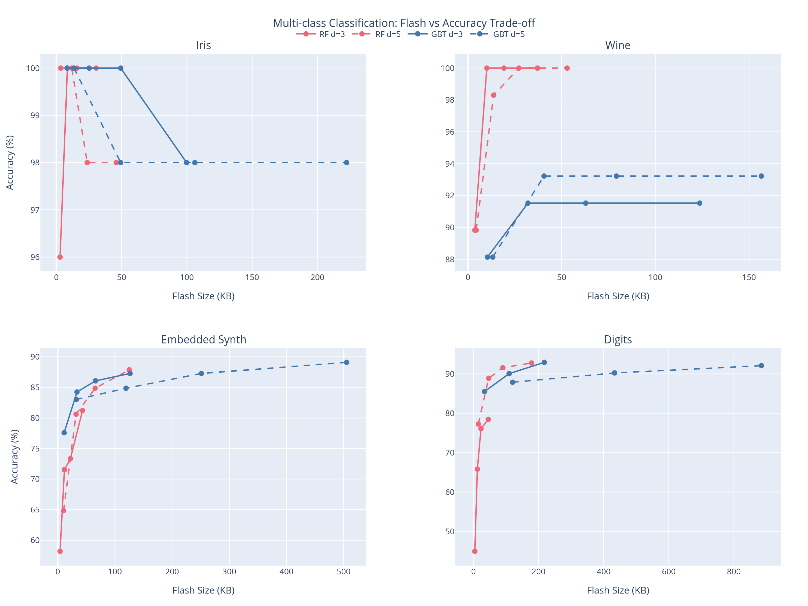

*Figure: Multi-class classification flash vs accuracy trade-off curves grouped by depth. Each line shows progression from n=3 to n=40 trees (solid=d3, dashed=d5). Iris and Wine show RF achieving 100% accuracy with minimal flash (<20KB), ideal for flash-constrained scenarios. Embedded Synth demonstrates steady accuracy gains with increased flash. Digits highlights GBT's advantage on complex tasks (90-92% accuracy) where RF plateaus around 78-92% depending on depth.*

##### Calibration Quality

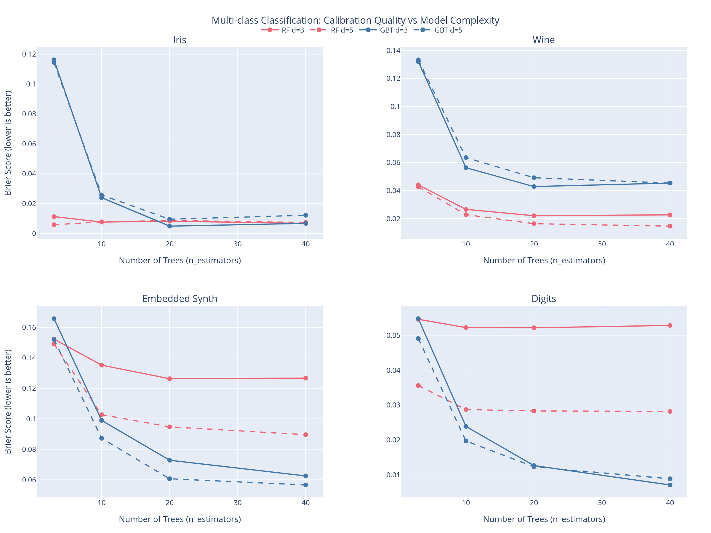

*Figure: Multi-class classification calibration quality (Brier score) vs model complexity. Lower scores indicate better-calibrated probabilities. Curves show n={3,10,20,40} trees (solid=d3, dashed=d5). Iris and Wine show GBT improving calibration with more trees, while RF maintains consistently good calibration. Embedded Synth shows depth-dependent patterns. Digits demonstrates strong calibration improvement for GBT, reaching Brier ~0.005 at n=40.*

#### Regression (predict mode only)

| Dataset | n | d | Type | predict | Flash | R² |
|---------|---|---|------|---------|-------|----|
| additive_synth | 40 | 5 | GBT | 45,362 | 198 KB | 0.97 |
| additive_synth | 40 | 5 | RF  | 45,542 | 219 KB | 0.91 |
| california     | 40 | 5 | GBT | 45,274 | 184 KB | 0.75 |
| california     | 40 | 5 | RF  | 45,233 | 193 KB | 0.69 |
| diabetes       | 40 | 5 | GBT | 45,366 | 173 KB | 0.37 |
| diabetes       | 40 | 5 | RF  | 45,425 | 192 KB | 0.48 |

GBT shows advantage on additive regression (0.97 vs 0.91 R²). RF wins on diabetes (0.48 vs 0.37 R²), where ensemble averaging yields better generalization on this small dataset.

### Sample Efficiency

How quickly do models reach peak accuracy as the number of trees grows (n={1,2,4,8}, depth=5, lr=0.1)?

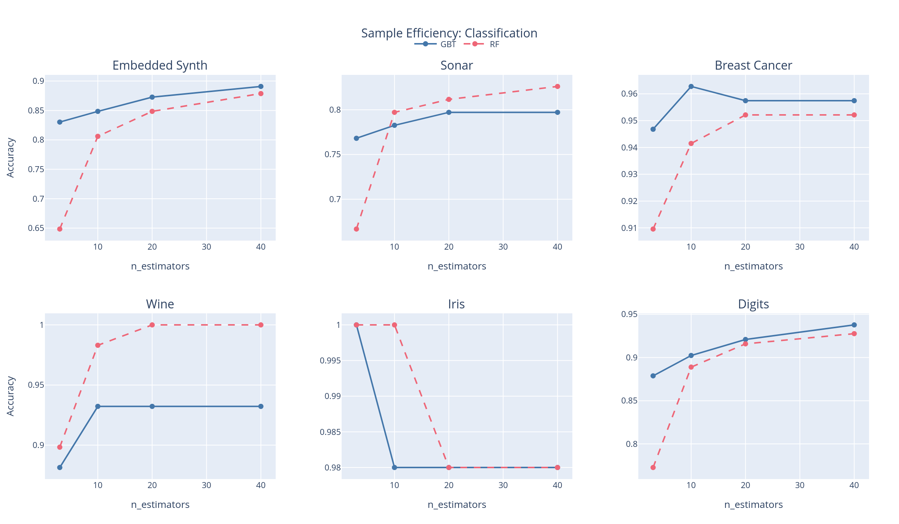

*Figure: Classification accuracy vs n_estimators for GBT (solid blue) and RF (dashed red). GBT often reaches near-peak accuracy with fewer trees on complex datasets (digits, sonar). RF saturates early on simpler datasets (iris, wine).*

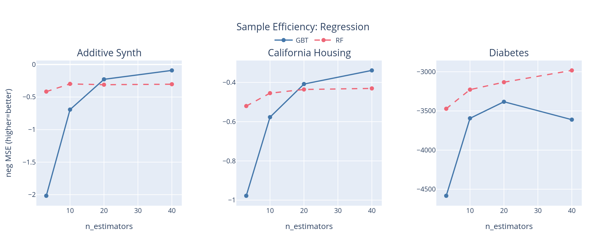

*Figure: Regression neg MSE vs n_estimators (higher = better). GBT improves rapidly on additive_synth due to its boosting-based structure. RF converges more slowly but achieves competitive performance on diabetes.*

Key findings:
- GBT reaches 90%+ of peak accuracy with n=2–4 trees on most classification datasets
- RF saturates faster on simple datasets (iris: 100% at n=1); GBT catches up at n=4–8
- For regression, GBT's boosting gives steeper initial improvement on structured tasks (additive_synth)
- On diabetes (small, noisy dataset), RF's ensemble averaging outperforms GBT across all n

### Size Constrained

What is the best achievable accuracy/R² when flash is limited to fixed budgets (2 KB–32 KB)?

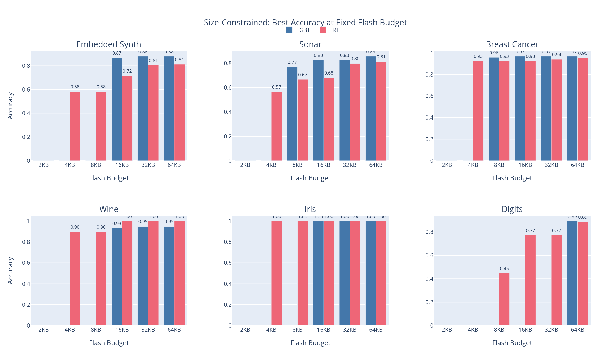

*Figure: Best classification accuracy at fixed flash budgets. Grouped bars show GBT (blue) vs RF (red). GBT bars are absent where no model fits within the budget.*

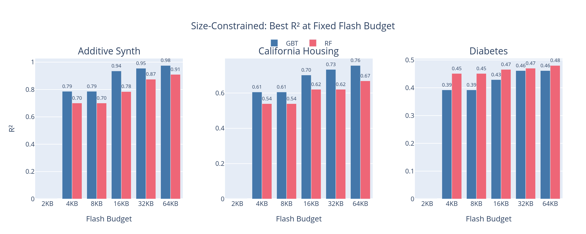

*Figure: Best regression R² at fixed flash budgets. GBT and RF compete across three regression datasets.*

Key breakpoints:

| Dataset | 2 KB winner | 8 KB winner | 32 KB winner | 64 KB winner |
|---------|-------------|-------------|--------------|--------------|
| embedded_synth | none | RF ~0.58 | RF ~0.81 | GBT ~0.84 |
| sonar | none | GBT ~0.77 | RF ~0.80 | RF ~0.81 |
| iris | none | RF 1.00 | GBT 1.00 | GBT 1.00 |
| wine | none | RF ~0.90 | RF 1.00 | RF 1.00 |
| breast_cancer | none | GBT ~0.94 | GBT ~0.96 | GBT ~0.96 |
| digits | none | RF ~0.45 | RF ~0.77 | RF ~0.89 |
| additive_synth | none | RF ~0.70 | RF ~0.87 | GBT ~0.96 |
| california | none | RF ~0.54 | GBT ~0.63 | GBT ~0.72 |
| diabetes | none | RF ~0.45 | RF ~0.47 | RF ~0.48 |

Key findings:
- Under 3 KB: No models fit (RF minimum ~2.9 KB, GBT minimum ~3.6 KB)
- At 8 KB: RF dominates most datasets; GBT competitive on sonar (~0.77) and breast_cancer (~0.94)
- At 32 KB: Mixed — RF still leads on simple datasets (iris, wine, sonar, embedded_synth); GBT leads breast_cancer (~0.96), california (~0.63)
- At 64 KB: RF leads digits (~0.89); GBT leads regression on additive_synth (R²~0.96) and california (~0.72)

### Regression Accuracy

R² achieved on regression tasks across model sizes, selecting the best learning rate per configuration:

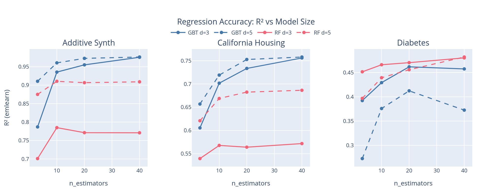

*Figure: R² (emlearn C inference) vs n_estimators for GBT (blue) and RF (red), with depth d=3 (solid) and d=5 (dashed). Best learning rate selected per configuration.*

emlearn C inference R² matches sklearn within 0.1% across all configurations, confirming numerical correctness of the C implementation.

Key findings:
- **additive_synth**: GBT benefits strongly from depth (d=5 >> d=3); RF also gains from depth
- **california**: GBT outperforms RF at depth 5; both converge at n=8 with GBT R²≈0.75
- **diabetes**: RF matches or beats GBT across all configurations (dataset too small for boosting to shine)

#### Key Insights

- **Activation overhead:** GBT `predict_proba` adds ~5.5-6.6K cycles (binary) or ~13-63K cycles (multi-class) over `predict` mode, varying by number of classes
- **RF predict_proba cost:** RF `predict_proba` adds ~7K-16K cycles (binary) or ~7K-17K cycles (multi-class) for division-based normalization
- **GBT vs RF speed:** RF is ~1.4-13x faster in `predict` mode for classification (no activation overhead, no per-class trees); for regression, GBT is similar or slightly faster
- **Flash tradeoffs:** GBT uses more flash than RF for classification (float leaf storage); for regression, GBT is typically smaller than RF at equal n and d
- **Accuracy patterns:** RF achieves 100% on small datasets (iris, wine), GBT excels on complex tasks (digits 10-class)
- **Flash limits:** digits GBT n=40 d=5 (~1.7 MB) exceeds nRF52840 flash (1 MB); n=20 d=5 (884 KB) is near the limit

### Platform Notes

| Platform | Timing | Notes |
|----------|--------|-------|
| host (CFFI) | Python overhead | Functional validation only |
| native_sim | Host CPU clock | Integration testing; timing runs on host CPU, not representative of target MCU |
| renode_nrf52840 | DWT cycles | Emulated MCU instruction-level timing |
| hardware | DWT cycles | Ground truth measurements on physical hardware |

Host CFFI times include Python/CFFI overhead and don't reflect native C performance. Native sim timing runs on your host CPU and should not be used for performance comparisons.


## Quick Start

```bash
# See GBT vs RF in action (offline, ~30s)
.venv/bin/python examples/mcu_benchmark/run_all.py --benchmark sample_efficiency --quick --host-only

# Quick validation (host only, reduced configs)
.venv/bin/python examples/mcu_benchmark/run_all.py --benchmark latency --quick --host-only

# All benchmarks on host
.venv/bin/python examples/mcu_benchmark/run_all.py --benchmark all --quick --host-only

# Renode benchmarks (requires: source .env.local)
source .env.local
.venv/bin/python examples/mcu_benchmark/run_all.py --benchmark latency --quick --renode-only

# Full sweep (all platforms, all benchmarks)
.venv/bin/python examples/mcu_benchmark/run_all.py --benchmark all

# Add results to an existing run directory (selected configs are re-run;
# per-config resume is not implemented)
.venv/bin/python examples/mcu_benchmark/run_all.py --resume runs/<timestamp>_sweep

# Generate figures from a specific run
.venv/bin/python examples/mcu_benchmark/generate_figures.py runs/<timestamp>_sweep
```


## Setup

```bash
# From the emlearn repo root:
uv venv
uv pip install -e .
uv pip install -r examples/mcu_benchmark/requirements.txt

# For MCU benchmarks (Renode/hardware), configure environment:
# Copy template to repo root and edit with your paths:
cp .env.local.example .env.local
# Edit .env.local with your Zephyr/Renode paths, then:
source .env.local
```


## Prerequisites

### Network Requirements

| Mode | Datasets | Network |
|------|----------|---------|
| `--quick` | embedded_synth, digits, additive_synth | Not required |
| Full | + sonar, wine, iris, breast_cancer, california, diabetes | sonar + california downloaded on first run |

`--quick --host-only` is fully offline-safe: all datasets are synthetic or bundled with scikit-learn.

### Host Benchmarks
- Python 3.9+ with venv set up as above

### Renode Benchmarks
- Renode emulator (set `RENODE_PATH` environment variable)
- Zephyr SDK (standalone install; sets `ZEPHYR_BASE` and `ZEPHYR_SDK_INSTALL_DIR`)
- west (installed via requirements.txt)
- `.env.local` sourced (see Setup)

### Native Sim Benchmarks
- 32-bit development libraries: `sudo apt install gcc-multilib g++-multilib`

### Hardware Benchmarks
- J-Link tools (JLinkExe)
- Target hardware connected (nRF52 DK or compatible)


## Sweep Parameters

### Full Sweep
| Parameter | Values |
|-----------|--------|
| n_estimators | 3, 10, 20, 40 |
| max_depth | 3, 5 |
| learning_rate (GBT) | 0.1, 0.2, 0.5 |

**Total configurations:** 24 GBT + 8 RF = 32 per dataset

### Quick Sweep (--quick flag)
| Parameter | Values |
|-----------|--------|
| n_estimators | 2, 8 |
| max_depth | 2, 4 |
| learning_rate (GBT) | 0.1 (fixed, not swept) |

**Total configurations:** 4 GBT + 4 RF = 8 per dataset

Note: Quick mode fixes learning_rate to 0.1 for faster testing. Full sweep (without `--quick`) tests lr={0.1, 0.2, 0.5}.

All results use `test_size=0.33` and `random_state=42` for reproducibility.


## Datasets

### Classification
| Dataset | Features | Classes | Samples | Purpose |
|---------|----------|---------|---------|---------|
| `breast_cancer` | 30 | 2 | 569 | Binary classification, medical domain |
| `sonar` | 60 | 2 | 208 | High-dimensional binary classification |
| `iris` | 4 | 3 | 150 | Classic ML baseline, minimal features |
| `wine` | 13 | 3 | 178 | Small dataset (RF often wins here) |
| `embedded_synth` | 15 | 3 | 500 | Controlled complexity, 3-class baseline |
| `digits` | 64 | 10 | 1797 | High-dimensional, many classes (GBT excels) |

### Regression
| Dataset | Features | Samples | Purpose |
|---------|----------|---------|---------|
| `additive_synth` | 5 | 1000 | Known function, validates regression accuracy |
| `california` | 8 | 2000 | Real-world housing data |
| `diabetes` | 10 | 442 | Small medical dataset |

Quick mode uses: `embedded_synth`, `digits`, `additive_synth`


## Output

### Run Directories

Results are saved to timestamped directories in `runs/`:

```
runs/<timestamp>_sweep/
├── config.json                    # Run configuration
├── results/
│   ├── latency.csv                # Per-benchmark results
│   ├── latency_embedded_synth.csv # Per-dataset granular results
│   ├── latency_digits.csv
│   ├── multiclass_latency.csv     # Multiclass scaling results
│   └── combined.csv               # All benchmarks combined
├── figures/                       # Generated by generate_figures.py
└── logs/
```

### CSV Format

| Column | Description |
|--------|-------------|
| model_name | Model identifier (e.g., "gbt_n10_d3_inline") |
| model_type | "gbt" or "rf" |
| n_estimators | Number of trees |
| max_depth | Maximum tree depth |
| learning_rate | GBT learning rate (null for RF) |
| platform | Target platform name |
| avg_cycles | Average CPU cycles per inference |
| avg_ns | Average nanoseconds per inference |
| flash_bytes | Model flash size (bytes) |
| benchmark_mode | "predict" or "predict_proba" |
| dataset | Dataset name (e.g., "breast_cancer") |
| accuracy | Model accuracy on test set |

The columns above are for the `latency` benchmark. Other benchmarks write separate CSVs with different columns (e.g., `probability_calibration.csv` includes Brier score and ECE; `regression_accuracy.csv` includes R² and MSE). See the per-benchmark CSV files in `results/` for their schemas.

### Figures

Generated by `generate_figures.py`. Pass a run directory as a positional argument; it reads CSVs from that run's `results/` subdirectory and writes PNGs into its `figures/` subdirectory.

```bash
.venv/bin/python examples/mcu_benchmark/generate_figures.py runs/<timestamp>_sweep
```

**Note:** Several figure functions (latency comparisons, calibration) cross-reference multiple run directories using hardcoded names at the top of `generate_figures.py` (`LATENCY_STD_RUN`, `CALIB_RUN_NAME`). If you re-run those benchmarks, update those constants to point to your new run directories before regenerating figures.


## File Structure

```
examples/mcu_benchmark/
├── README.md                 # This file
├── __init__.py               # Package exports
├── data/                     # Pre-computed result CSVs (committed)
├── run_all.py                # Main orchestrator
├── common.py                 # Shared utilities, RunContext
├── model_configs.py          # Model configuration matrix
├── datasets.py               # Dataset definitions
├── checkpointing.py          # Config hashing and checkpoint state helpers
├── metrics.py                # Accuracy and calibration metrics
├── mcu_runner.py             # MCU execution helpers (Renode, timeout scaling)
├── process_manager.py        # Parallel job management (joblib)
├── figures/                  # Committed PNG figures (generated by generate_figures.py)
├── generate_figures.py       # Plotly figure generation
├── requirements.txt          # Python dependencies
├── benchmarks/               # Individual benchmark modules
│   ├── __init__.py
│   ├── latency.py            # Inference timing
│   ├── multiclass_latency.py # GBT latency scaling with n_classes (sigmoid/softmax)
│   ├── sample_efficiency.py  # Trees vs accuracy
│   ├── pareto_efficiency.py  # Accuracy vs flash Pareto
│   ├── regression_accuracy.py# Regression metrics
│   ├── probability_calibration.py  # Calibration metrics
│   └── size_constrained.py   # Flash budget optimization
└── runs/                     # Timestamped run directories
```


## Limitations and Future Work

This benchmark suite is under active development. Known limitations:

- **Renode vs hardware**: Emulated timing may differ from physical hardware
- **Limited hyperparameter sweep**: Quick mode uses learning_rate=0.1 only
- **Dataset selection**: Results may not generalize to all embedded ML use cases
- **Random seed variation**: Accuracy results will vary between runs
- **Single platform focus**: Most testing on nRF52840 (Cortex-M4F with FPU)

Potential improvements:
- Hardware validation on physical boards
- Broader hyperparameter exploration
- Additional MCU architectures (Cortex-M0, RISC-V, no-FPU variants)
- Memory usage profiling (stack, heap)
- Power consumption measurements

Contributions and feedback welcome.


## Adding New Platforms

Adding a new target platform requires three steps:

### 1. Define Board Configuration

Add an entry to the `BOARDS` dict in `emlearn/mcu/boards.py`. Import the required enums at the top of the file:

```python
from emlearn.mcu.boards import BoardConfig, TimingSource, OutputMethod, FlashMethod

# In BOARDS dict:
'my_board': BoardConfig(
    name='my_board',
    device='MY_DEVICE',      # J-Link device name (e.g., 'nRF52832_xxAA')
    cpu_freq_hz=64_000_000,  # CPU frequency in Hz
    has_dwt=True,            # Has ARM DWT cycle counter
    timing_source=TimingSource.DWT,
    output_method=OutputMethod.RTT,  # or SERIAL, NATIVE, RENODE
    flash_method=FlashMethod.JLINK,  # or WEST, NONE, RENODE
    is_emulator=False,       # True if emulated (Renode, native_sim)
),
```

### 2. Create Board Configuration File

Create board overlay in `platform_examples/zephyr/benchmark/boards/my_board.conf` with Zephyr-specific settings.

### 3. Register Platform in Benchmark System

Add entry to `PLATFORMS` dict in `examples/mcu_benchmark/model_configs.py`:

```python
PLATFORMS['my_board'] = {
    'name': 'my_board',
    'type': 'hardware',  # 'host', 'native', 'renode', or 'hardware'
    'description': 'My Custom Board (Cortex-M4F with FPU)',
    'has_fpu': True,
}
```

This makes your board available to `run_all.py --platforms my_board`.


## Micro-Benchmarks

Firmware micro-benchmarks validate timing assumptions:

```bash
# Enable micro-benchmarks in board config (boards/renode_nrf52840.conf or prj.conf):
# CONFIG_EMLEARN_BENCHMARK_MICRO=y

# Run and look for RESULT:MICRO lines in output
```

Available benchmarks (enabled with `CONFIG_EMLEARN_BENCHMARK_MICRO=y`):

| Benchmark | Expected Cycles | Purpose |
|-----------|-----------------|---------|
| INT_OPS | ~1 | Integer baseline (CPI validation) |
| FP_OPS | ~1 | FP add/mul baseline |
| FP_DIV | ~14 | Known multi-cycle operation |
| EXPF | 50-200 | Library function cost |
| SIGMOID | 60-250 | Full 1/(1+exp(-x)) cost |

Output format:
```
RESULT:MICRO:EXPF avg_cycles=150 iterations=1000
RESULT:MICRO:SIGMOID avg_cycles=180 iterations=1000
```


## Command Reference

```bash
# Platform selection
--host-only           # Host CFFI only
--renode-only         # Renode emulator only
--hardware-only       # Physical hardware only
--no-host             # Skip host (Renode + hardware)
--validation-only     # Host + native_sim
--benchmark-only      # Renode + hardware
--platforms X Y       # Specific platforms

# Benchmark selection
--benchmark all                    # All benchmarks
--benchmark latency                # Timing only
--benchmark multiclass_latency     # GBT softmax latency and flash scaling with n_classes
--benchmark latency sample_efficiency  # Multiple

# Task selection
--task classification  # Classification datasets only
--task regression      # Regression datasets only
--task both            # All datasets (default)

# Compilation method
--methods inline       # float features, C array inlined in header (default)
--methods loadable     # int16 features with x1000 scaling, smaller flash, slight accuracy loss

# Other options
--quick               # Reduced parameter sweep
--extended            # Extended n_estimators sweep (1,2,3,5,7,10,15,20,30,50,75,100)
--n_jobs -1           # Parallel jobs (-1 = all cores)
--resume PATH         # Write into existing run directory (re-runs selected configs)
--datasets X Y        # Specific datasets
--traversal index     # Tree traversal mode (index or pointer)
--verbose             # Verbose output
```